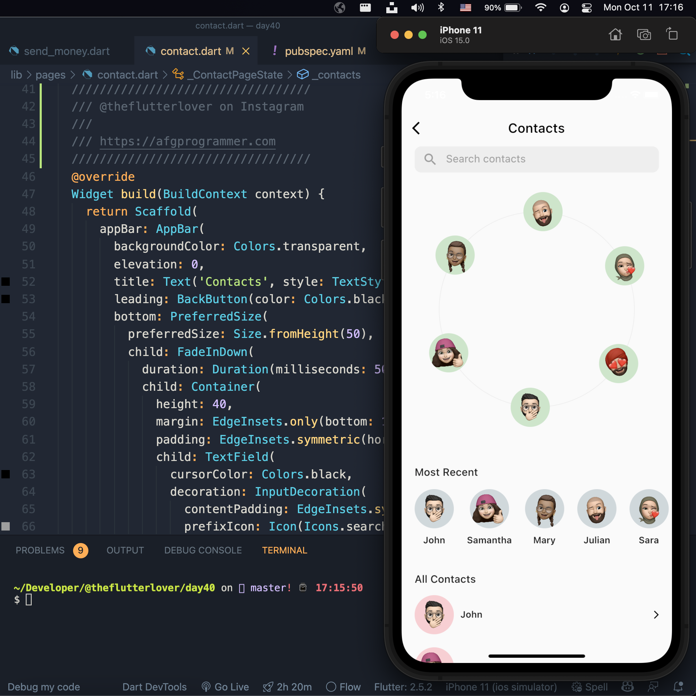

# Wallet  Application Flutter 
 > Wallet application is a mobile application user interface   for managing one's day to day finances expenses  exploring different user  screens required for a kind of application

### Wallet Page

### Contact Page

### Send Money Page

### Contact Page

## Built With

- Webpack
- HTML & CSS
- GitFlow
- Linters
- Documented Work

## Development set up
Clone Repository  using 
`git@github.com:isaacpitwa/wallet_app.git` 

OR  using HTTPS

`https://github.com/isaacpitwa/wallet_app.git` 

move into project directory
`cd wallet_app`

Install  Project dependancies using `pub`

`flutter pub get`

launch project locally on real device or Emulator

`flutter run` 

## 👤 Author

- GitHub: [@isaacpitwa](https://github.com/isaacpitwa)
- Twitter: [@isaacpitwa](https://twitter.com/isaacpitwa)
- LinkedIn: [LinkedIn](https://linkedin.com/in/isaac-pitwa)
